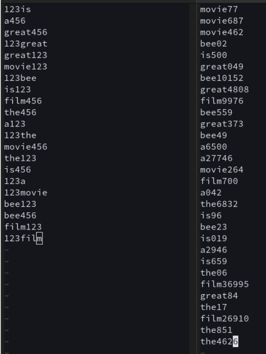

# WordGen changes v1.02:
-Cleaned up the main() function a bit, and added an easy exit upon start up 
&nbsp;&nbsp;&nbsp;&nbsp;&nbsp;&nbsp;-Removed the input() from print_header() as it added extra delay and didn't allow for an immediate exit. 
-Did a memory test, no leaks noticed 
-Added more comments for future readability 
-Removed "❯ It will automatically shut down after 5 seconds..." as it is now pointless 
-Future-proofed option 2 by making it read current year for max, instead of being limited to 2025 
&nbsp;&nbsp;&nbsp;&nbsp;&nbsp;&nbsp;-Downside is imported date 

 
 
 
 
 

# WordGen changes v1.01: 
-Removed bloat sleeps (14 of them)  
-Added randomness to numbers, they were previously set to repeat 123,123,456 and nothing else 
-Adjusted code to no longer utilise the time package, making it slightly more lightweight 
&nbsp;&nbsp;&nbsp;&nbsp;&nbsp;&nbsp;-Updated option 1 to include random, something that was previously missing entirely. Technically it is possible to generate a file with the same default name, but considering the odds are 1/10000000000 it shouldn’t be an issue. 
-Removed many formatting commands due to them not working in every environment and potentially being unfriendly to users with colour impairment. 
&nbsp;&nbsp;&nbsp;&nbsp;&nbsp;&nbsp;-Technically reduces resources required but by a very minimal amount.  
&nbsp;&nbsp;&nbsp;&nbsp;&nbsp;&nbsp;-Kept formatting for the title as that should not have negative consequences in other environments. 
&nbsp;&nbsp;&nbsp;&nbsp;&nbsp;&nbsp;-ALL line breaks were preserved, and a few were added for extra readability. 
-Added some comments throughout code to make it as easy to use for others later on. 
-Replaced all clear_screen_with_message() (21) to print() to ensure users can backtrack lines in all environments, allowing users to check filenames and other input later. 
-Added utility for count for option 
-Option 2-5 are untouched besides removal of formatting. 
-Added .strip() to catch any random spaces 

Before(left) and after(right): Input: 
“the bee movie is a great film” 
Words + Numbers (e.g., word123, 123word) 
Count 30 

